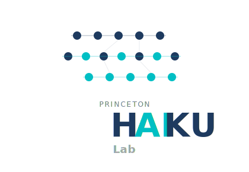

The **Princeton HAIKU Lab** studies how humans and AI systems collaborate in complex decision-making environments. We use applied modeling, statistical evaluation and experimentation, combined with normative and sociotechnical analysis to understand and improve human-AI collaboration in consequential domains. Our goal is to design, evaluate, and guide the implementation of AI systems that advance human and societal outcomes for all.
