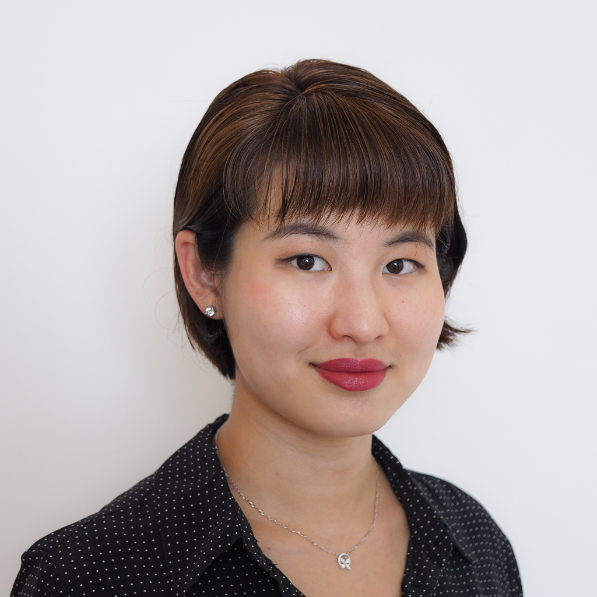

	
	
# Lydia T. Liu #

I am a postdoctoral associate at [Cornell University Computer Science](http://cis.cornell.edu/cornell-computing-information-science), working with [Jon Kleinberg](https://www.cs.cornell.edu/home/kleinber/), [Karen Levy](https://www.karen-levy.net), and [Solon Barocas](http://solon.barocas.org) in  the [Artificial Intelligence, Policy, and Practice (AIPP)](https://aipp.cis.cornell.edu) initiative. My research examines the **theoretical foundations of machine learning and algorithmic decision-making**, with a focus on **societal impact and welfare.** <!-- Other interests include microeconomics and high-dimensional statistics.--> 

I obtained my PhD in [Electrical Engineering and Computer Sciences](https://eecs.berkeley.edu/) in 2022 from University of California, Berkeley, where I was advised by [Moritz Hardt](http://mrtz.org/) and [Michael I. Jordan](https://people.eecs.berkeley.edu/~jordan/). I was supported by a [Microsoft Ada Lovelace Fellowship](https://www.microsoft.com/en-us/research/academic-program/ada-lovelace-fellowship/) and an [Open Philanthropy AI Fellowship](https://www.openphilanthropy.org/focus/global-catastrophic-risks/potential-risks-advanced-artificial-intelligence/open-phil-ai-fellowship-2019-class). 

Previously, I received my BSE in [Operations Research and Financial Engineering](https://orfe.princeton.edu/) from Princeton University, where I was fortunate to work with [Barbara Engelhardt](https://www.cs.princeton.edu/~bee/), [Han Liu](https://www.princeton.edu/~hanliu/), and [Amit Singer](https://web.math.princeton.edu/~amits/). I have also spent two wonderful summers interning at Microsoft Research: hosted by Urun Dogan and [Katja Hofmann](https://www.microsoft.com/en-us/research/people/kahofman/) in the [Reinforcement Learning Group](https://www.microsoft.com/en-us/research/group/reinforcement-learning-group/) at [MSR Cambridge](https://www.microsoft.com/en-us/research/lab/microsoft-research-cambridge/) in 2016, and hosted by [Christian Borgs](http://christianborgs.com/), [Jennifer Chayes](http://jenniferchayes.com/), and [Adam Tauman Kalai](https://www.microsoft.com/en-us/research/people/adum/) at [MSR-NE](https://www.microsoft.com/en-us/research/lab/microsoft-research-new-england/) in 2019.

<!-- [pictures](https://www.flickr.com/photos/158535173@N08/) --> 
[*My work as a poet.*](/writing)

> **Updates**. (May 2022) I graduated from Berkeley! Read my dissertation: [_Social Dynamics of Machine Learning for Decision Making_](https://www2.eecs.berkeley.edu/Pubs/TechRpts/2022/EECS-2022-41.html).
<!--  (Oct 2021) [I attended MIT EECS Rising Stars 2021](https://risingstars21-eecs.mit.edu/liu-lydia-tingruo/)---[apply](https://risingstars21-eecs.mit.edu) for the fall 2022 workshop at UT Austin! We presented our [poster for _Strategic ranking_](/assets/strategic_ranking_poster.pdf) at the inaugural ACM conference on EAAMO. [_Bandit Learning in Decentralized Matching Markets_](https://jmlr.org/papers/v22/20-1429.html) is in vol. 22 of JMLR. See [EC workshop poster](/assets/decentralizedbandits_poster.pdf) and [FODSI talk](/assets/learning_markets.pdf).--> 

			
Email: `lydiatliu_at_berkeley_dot_edu`

